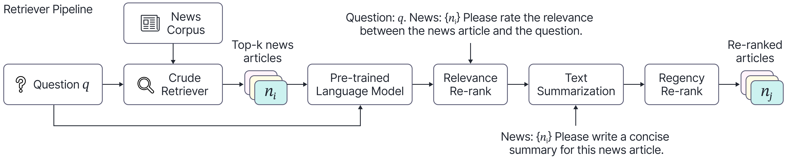

# AutoCast++: Enhancing World Event Prediction with Zero-shot Ranking-based Context Retrieval
This repository contains the code for the paper [AutoCast++: Enhancing World Event Prediction with Zero-shot Ranking-based Context Retrieval](https://arxiv.org/abs/2310.01880).



## Get Started
* Setup python environment
```bash
conda create -n autocastpp python=3.8
conda activate autocastpp
pip install -r requirements.txt
```
* Download datasets
```bash
# download autocast dataset
mkdir -p datasets/source

wget -P datasets/source https://people.eecs.berkeley.edu/~hendrycks/autocast.tar.gz 

tar -xvf datasets/source/autocast.tar.gz -C datasets

ln -s $(pwd)/datasets/autocast/autocast_questions.json competition/autocast_questions.json
ln -s $(pwd)/datasets/autocast/autocast_questions.json autocast_experiments/data/autocast_questions.json

ln -s $(pwd)/datasets/autocast/negated_tf_questions.json autocast_experiments/data/negated_tf_questions.json
ln -s $(pwd)/datasets/autocast_cc_news_retrieved.json autocast_experiments/data/autocast_cc_news_retrieved.json

# download CC news corpus
# use the source data shared by the author, link: https://github.com/andyzoujm/autocast/issues/2
gdown https://drive.google.com/uc?id=1-9bK_3fl41GyCeMrzfneItu5VT0Qx0rZ -O datasets/source/cc_news.tar.gz
# a more stable way to download from google drive: https://stackoverflow.com/a/67550427/8683446
# export ACCESS_TOKEN=XXX
# export FILE_ID=19xbJYuIbzNuKus8vkvQ2GzRJ52U9mAY2
# export FILE_NAME=cc_news.tar.gz
# curl -H "Authorization: Bearer $ACCESS_TOKEN" https://www.googleapis.com/drive/v3/files/$FILE_ID?alt=media -o $FILE_NAME 

tar -xvf datasets/source/cc_news.tar.gz -C datasets
```
* Structure of the `datasets` folder
```
datasets
├── autocast
│   ├── autocast_questions.json
│   ├── negated_tf_questions.json
│   └── README.md
├── cc_news
│   ├── dataset.arrow
│   ├── dataset_info.json
│   └── state.json
└── source
    ├── autocast.tar.gz
    └── cc_news.tar.gz
```

* Processing the CC news corpus
```bash
# step 1: information retrieval
bash retrieve_cc_news_bm25+ce.sh

# step 2: creating training data
python autocast_experiments/data/process.py --static_only
```

* Download huggingface t5 models

Please do `cd autocast_experiments` before running the following commands.
```python
import transformers
tokenizer = transformers.T5Tokenizer.from_pretrained('t5-small', model_max_length=1e6, cache_dir='huggingface_cache')
tokenizer = transformers.T5Tokenizer.from_pretrained('t5-base', model_max_length=1e6, cache_dir='huggingface_cache')
tokenizer = transformers.T5Tokenizer.from_pretrained('t5-large', model_max_length=1e6, cache_dir='huggingface_cache')
tokenizer = transformers.T5Tokenizer.from_pretrained('t5-3b', model_max_length=1e6, cache_dir='huggingface_cache')
t5 = transformers.T5ForConditionalGeneration.from_pretrained('t5-small', cache_dir='huggingface_cache')
t5 = transformers.T5ForConditionalGeneration.from_pretrained('t5-base', cache_dir='huggingface_cache')
t5 = transformers.T5ForConditionalGeneration.from_pretrained('t5-large', cache_dir='huggingface_cache')
t5 = transformers.T5ForConditionalGeneration.from_pretrained('t5-3b', cache_dir='huggingface_cache')
```

* Training of vanilla baseline models
```bash
bash train.sh large 10 0.0 4 30 6 cosine 1e-4 0.01 0.10
# see train.sh for more details
```

## Citation

If you find our work useful in your project, please consider citing:

    @article{yan2023autocast++,
    title={Autocast++: Enhancing world event prediction with zero-shot ranking-based context retrieval},
    author={Yan, Qi and Seraj, Raihan and He, Jiawei and Meng, Lili and Sylvain, Tristan},
    journal={arXiv preprint arXiv:2310.01880},
    year={2023}
    }
